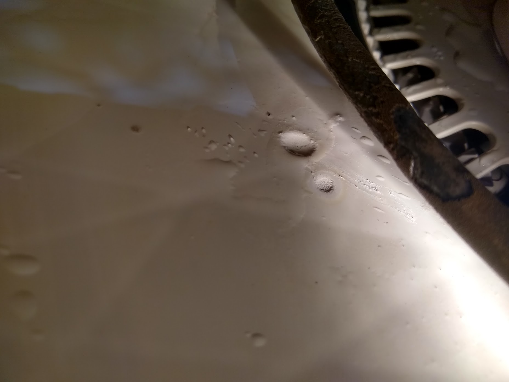
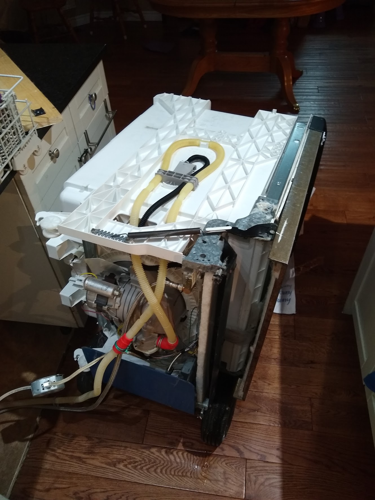
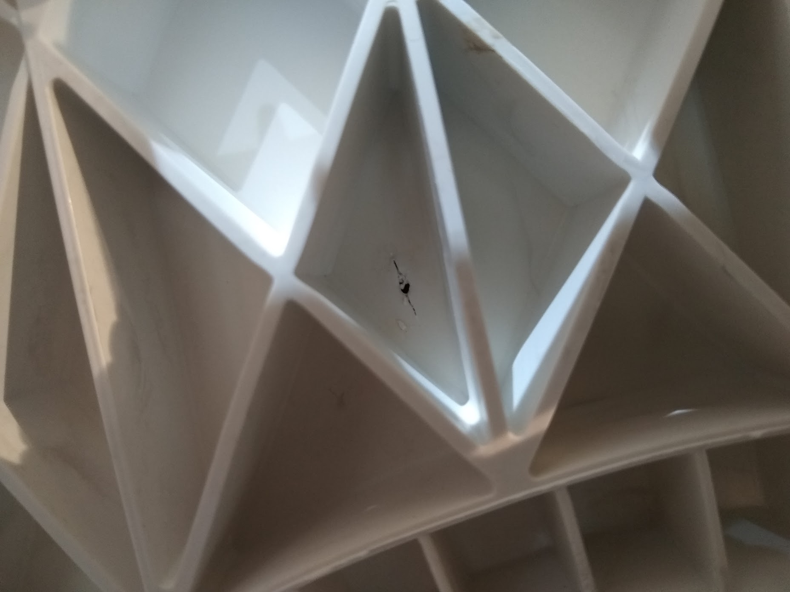
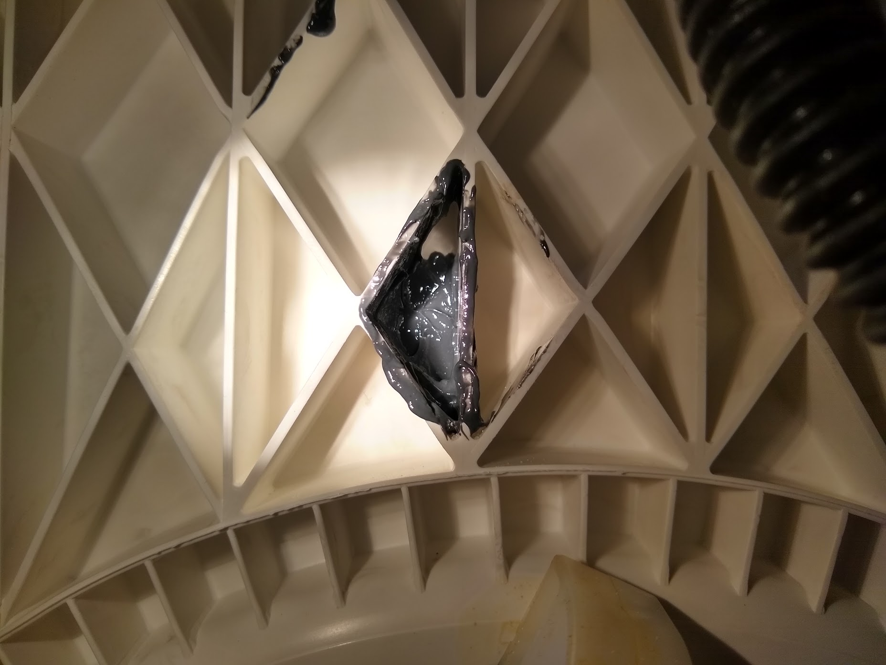

# Fixing My Dishwasher

_February 15, 2020_

I noticed the drywall/paint peeling off the ceiling edge of my basement office and discovered it was quite wet. I immediately linked that to the kitchen being directly above and the dishwasher running.  Looking under the dishwasher I found a puddle.  After I pulled it out and got some better lighting, I ran it again and found a slow dripping coming from the underside. I had expected to find a loose drain or water supply hose but that wasn't the case.

Looking inside, I immediately found a probable cause, a small melted bit under the heating coil.  I'm going to guess that a metal object like a spoon got wedged under and transfered heat into the plastic tub (ABS I think?).

Unplugged the water supply, drain house, and shut the breaker off because I learned that this (all?) dishwasher is wired directly to the circuit. I had an idea to use my dolly to help lower it onto its side.

Upon closer inspection it was quite clearly confirmed what the problem was. I could fit a toothpick through the hole. After discussing with some friends we agreed that the hole is small enough that some epoxy rated for ABS and high temperatures would work. Marine epoxy was my first thought.  Though the options were limited at the store and I'm an impatient person with two toddlers so we really just wanted to get it fixed and for the kitchen to be safe again (note: this is me saying I cut a corner that you probably shouldn't).

Ended up going with JB Weld steel reinforced epoxy.  I had marine epoxy in my hand but I didn't recognize the brand and the max temp (150C) was much lower than what the JB Weld epoxy was rated for (260C).

I managed to get the epoxy into the hole an could see it pooling when I looked inside the dishwasher. I'm really happy with how this went and am going to apply some from the inside of the dishwasher too, once it cures a little.

My main concern is that this epoxy will not stand up to a lot of expansion/contraction caused by the heating element. Other than that, I'm confident the hole is small enough that this much epoxy will surely plug the gap.

Now I need to fix that soaked drywall before mold begins to form.

Home ownership is fun!

# Update
_August 26, 2020_

Still holding just fine. I was convinced that because of the kind of plastic, the epoxy wouldn't take. That's kind of true. It doesn't look like it's truly epoxied. It's kind of just plugging the hole. With enough screwing with it, I'm sure it would fail.
