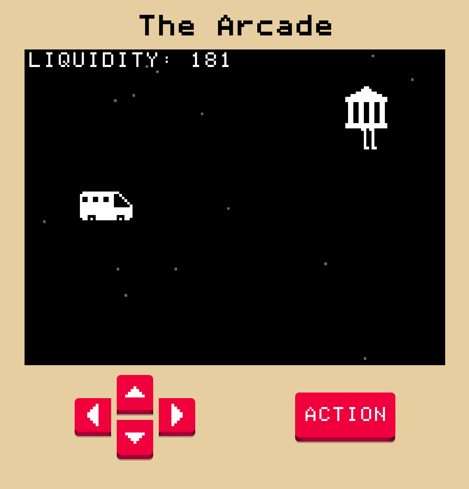

# Games

I've written a few little games for fun. I have a bunch of others that are, naturally, in various stages of incompleteness.

# The Arcade

_January, 2023_

I wrote a small game engine for simple arcade games as a way to get around the "I'm bad at art." You can't be bad at art when you only have an Atari worth of pixels to work with.

Currently there's two games:

- _Spy Balloon!_: Shoot down the secret spy balloons!
- _Bank Run!_: There's a run on the bank. Can you stop it?

[Play it Here](https://arcade.pointless.click/)

# The State Machine

_June 1, 2018_

I wanted to make a game based on a pun. It would be a finite state machine based on U.S. states. I kind of accomplished that, but the state machine portion was much simpler than I planned. Nevertheless, it's actually a very balanced challenge and pretty fun.

[Play it Here](https://ablakey.github.io/state-machine/index.html)

# Lights Out!

_November 29, 2020_

Whenever you toggle a light, it also toggles its neighbours. This is a game I remember from my childhood. Similar to a puzzle found in System's Twilight for the Macintosh.

[Play it Here](https://ablakey.github.io/lights-out/index.html)

