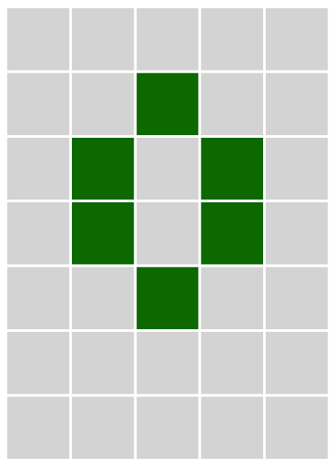

# Games

I've written a few little games for fun. I have a bunch of others that are, naturally, in various stages of incompleteness.

# The State Machine
*June 1, 2018*

I wanted to make a game based on a pun. It would be a finite state machine based on U.S. states. I kind of accomplished that, but the state machine portion was much simpler than I planned. Nevertheless, it's actually a very balanced challenge and pretty fun.

[Play it here](https://ablakey.github.io/state-machine/index.html)

# Lights Out!
*November 29, 2020*

Whenever you toggle a light, it also toggles its neighbours.  This is a game I remember from my childhood. Similar to a puzzle found in System's Twilight for the Macintosh.

[Play it here](https://ablakey.github.io/lights-out/index.html)

