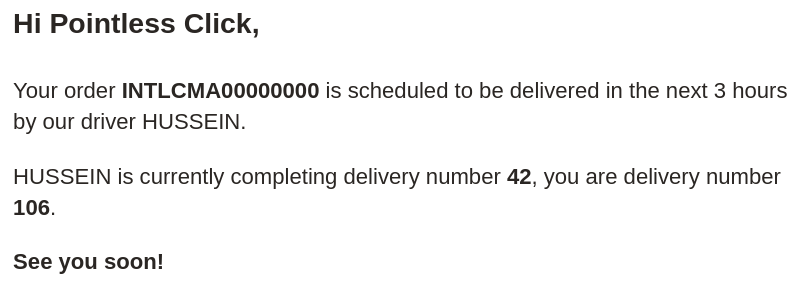
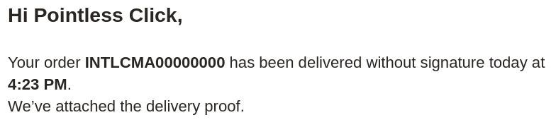
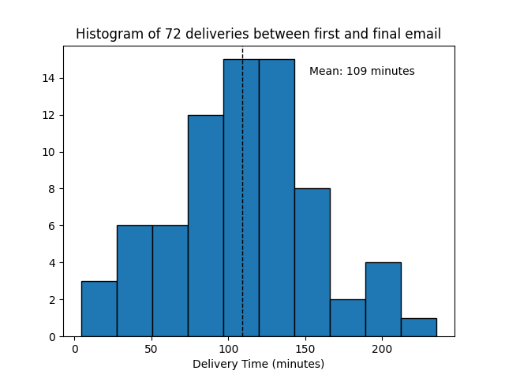
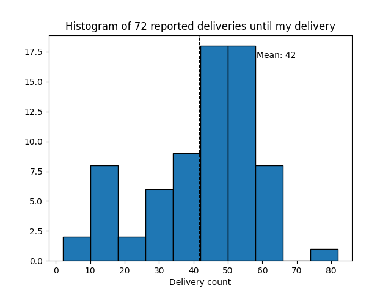
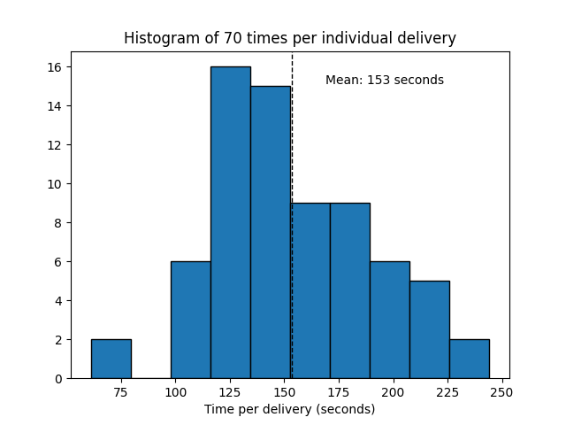

Every time I order something from Amazon, it is delivered via a courier called Intelcom. They will send me **two** emails that contain some interesting metadata. From these emails I got curious about a few things:

- How long does the delivery typically take?
- How long does each driver's delivery typically take?
- Do I get the same few drivers for all my deliveries?
- Any interesting patterns in the data?

GitHub Repo: [https://github.com/ablakey/intelcom-perf](https://github.com/ablakey/intelcom-perf)

## Input Data

I got all of these emails out of my Gmail by doing a query for them, applying a label, and then using Google Takeout to extract just that label. The result is a .mbox file of 140 or so emails.

I never heard of mbox before and I was a bit surprised that Python's standard library has a parser for it (`mailbox`). Okay maybe not that surprised. Python's stdlib is huge. A decade into my use of Python and I still find new stuff.

## Parsing and Analysis
The scripts are very straightforward. I'd just read them in the GitHub repo for more details. I parse the .mbox file, use regex to get stuff out of them, compile a .json file, and then run that through a chart generator script.

## Results
86 deliveries. Only 72 had both emails. I probably deleted some by accident.

### Delivery time
After receiving the first email, it takes about 109 minutes before my package is delivered.  Only 72 data points but I see a bit of a normal distribution. Probably safe, for my personal needs, to use "just under 2 hours" in my mental model.

### Number of Delveries Before Mine
I was curious what governs when they send the first email and how many deliveries there are before mine. I thought that maybe they send the email when "40 deliveries are left" or something.  Looks like the answer is no. The email probably goes out when theres approximately `x` hours left. Or maybe a percentage of the driver's total deliveries? Dunno. Not too interested.

### Time per Delivery
I was curious if maybe I could estimate how long it takes for a driver to deliver a package, given I know how many deliveries they have to make and how long it took. There might be some signal here. I'm not too interested in being a statistician today.

Note: I removed 2 extraneous points where it took so long that it broke the graph. Maybe those are data errors. Eg. "only 7 deliveries before mine and the driver took a lunch break."

### Driver names
Of the 72 packages, there were 31 different driver names.

Given I live in a city of 40 000 people I was a bit surprised to see that there's so many. Two driver names make up about 50% of my deliveries: Mohammad and Mohammed.  These might be very popular names, so I'm inclined to believe that there's no obvious pattern here. I'm not interested in digging further.

## Notes and Future Analysis
This is a small project to satisfy my curiosity. If you see a lacking in rigor... yes.

I broke the workflow up into two scripts to make my life easier: parse the data, generate graphs/stats. This also means I have an intermediate file, which is a really nice escape hatch to manually explore the data when debugging. Maybe it'll be useful for other things too.

I focus on keeping the scripts dead simple. I can optimize later.

Are delivery times changing over time? Do they get better or worse seasonally?
