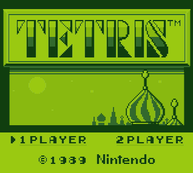

# Game Boy Emulator
*August 10, 2021*

I've been meaning to talk about this for a long time and still owe an actual posting about it. In an attempt to get familliar with Rust, I wrote a Game Boy emulator.

[Source Code](https://github.com/ablakey/gameboy)

