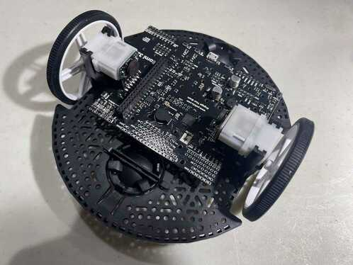
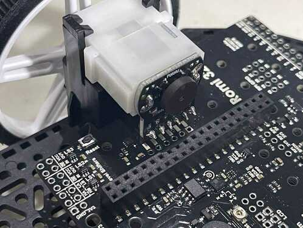
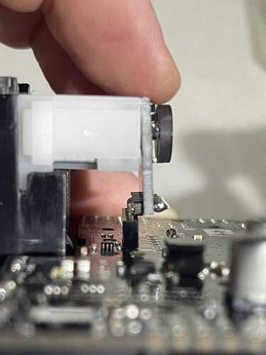

# Minibot

*December 10, 2022*

**This page will be updated regularly**

I'm building a Pololu Romi + Raspberry Pi that will do... I'm not quite sure what, yet.

This is one of many kits owned by the FRC Team 7475 "Wired" in Ontario, donated by Locus Robotics.  This page will likely serve as some basic guidance (alongside the existing online documentation) and some lessons learned about the process.  I think we're going to try to do some basic vision work with the Raspberry Pi camera.

# Hardware

## Capabilities

Once assembled, the Romi Control Board has:

- 3 programmable buttons
- 3 programmable LEDs
- 2 motors with encoders
- an accelerometer

## Assembly

While assembly can be fairly intuitive, the [Pololu Romi Chassis User's Guide](https://www.pololu.com/docs/0J68) is a great resource for verifying any assumptions being made. Be careful about where the instructions describe a differing options depending on what hardware you're mounting. In this case, we're mounting the **Romi 32U4 Control Board**, which changes some steps:

1. you **do not** need to jumper the two sets of AA batteries, the control board has slots for both and handles the serialization of voltage for you
2. The Raspberry Pi (Model 3 B) will mount directly to this board via the GPIO cluster of pins

## Soldering

!> Before you solder anything, dry fit everything to make sure you have the right idea

As you solder each section, use a multimeter to verify you haven't shorted any of the pins to each other. Be sure to follow soldering best practices regarding temperature and methods. Dry joints on a small mobile robot will eventually wiggle loose and you'll get a very frustrating kind of problem to debug: randomly occurring, intermittent issues.

There are 5 areas to solder:

1. The 6-pin socket connector strips for the wheel encoder/power supplies (
    - note there are two sets of holes, you want the one closest to the wheels
2. The L-shaped 6-pin male jumpers into the encoders
    - be sure you dry-fit these first, there's many ways do orient them wrongly
    - the black frame must be flush with the encoder board
3. The power pins between the motors and the encoder board
    - be especially careful not to apply too much heat for too long as this can warp the brushes in the motor
4. The buzzer in the middle of the board
    - make sure to orient this properly, but it's easy given the outline shape of the buzzer is printed on the board
5. The four battery pins that connect the battery leads/springs to the board
    - in order to remove the board later, you can squish the springs through the holes and pull them up with the board
    - the battery leads will be delicate when removed from the frame, so be careful

## Images

# Software

## Installing Raspberry Pi OS

The `Raspberry Pi Imager` makes this completely painless.  It will:

- Download the desired OS (Raspberry Pi OS Lite 64-bit)
- Format and properly partition an SD Card then install the above OS
- Allow you to set things such as the Wifi credentials, the local hostname for the device, and an ssh password

# FAQ

### How is the Raspberry Pi powered?

The Raspberry Pi is powered by the GPIO pins at the top end of the cluster. They supply VCC (5V) and ground from the Control Board.

Note that there is no power regulation or safety circuits, so these pins MUST be supplying 5V, which the Control Board does guarantee.

### Can I power the robot from both the batteries and the 5V USB cable?

Probably not, but I'm not 100% sure. The main issue is that they won't have a common ground (look this up, it's important!) so there's no guarantee you won't short everything with a voltage overload.  If the answer is yes, it's because the boards were specifically designed to handle this. But I think it's unlikely.  Best not to risk it.

### How do I mount the Raspberry Pi camera and the illumination ring?

I don't know yet.

### The HDMI port is blocked by a motor!

You can partially disassemble the robot, but think about what that means: any time you want a screen, you need to muck with your hardware.  A better option is to try to never require a screen. This can be accomplished by setting up Wifi and network settings when installing the OS via the `Raspberry Pi Imager`.  This way you can just `ssh` to the robot's computer from a PC on your network.
